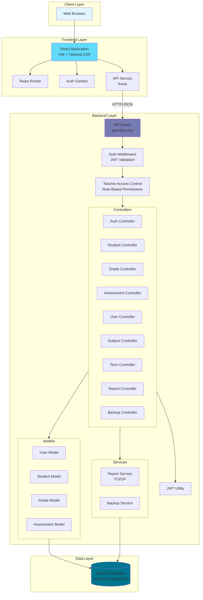
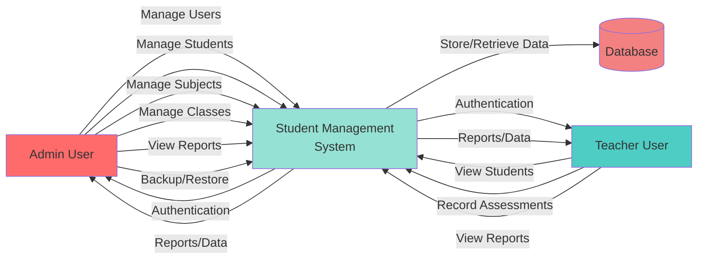
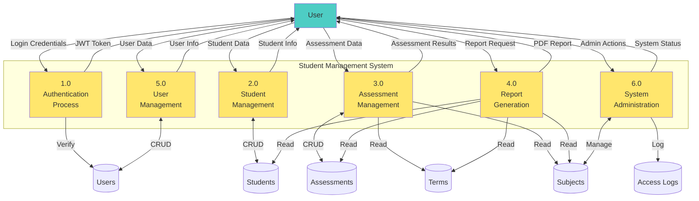
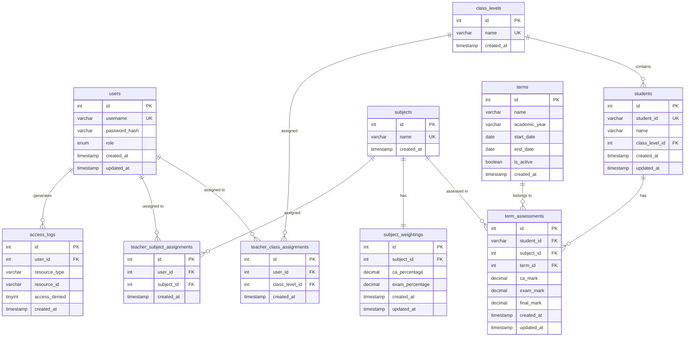
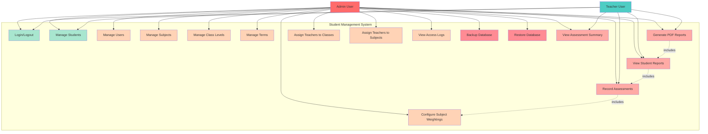
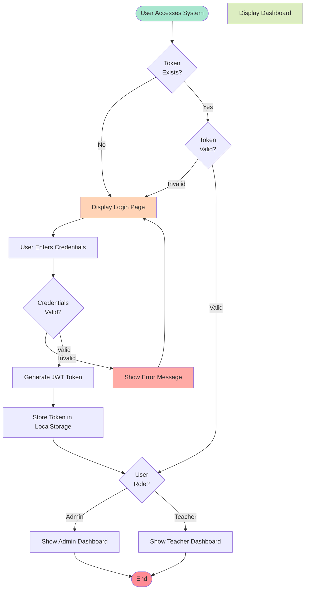
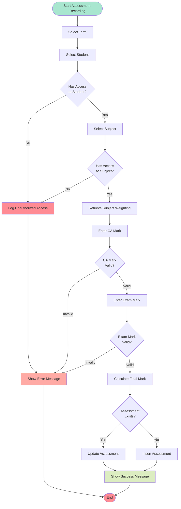
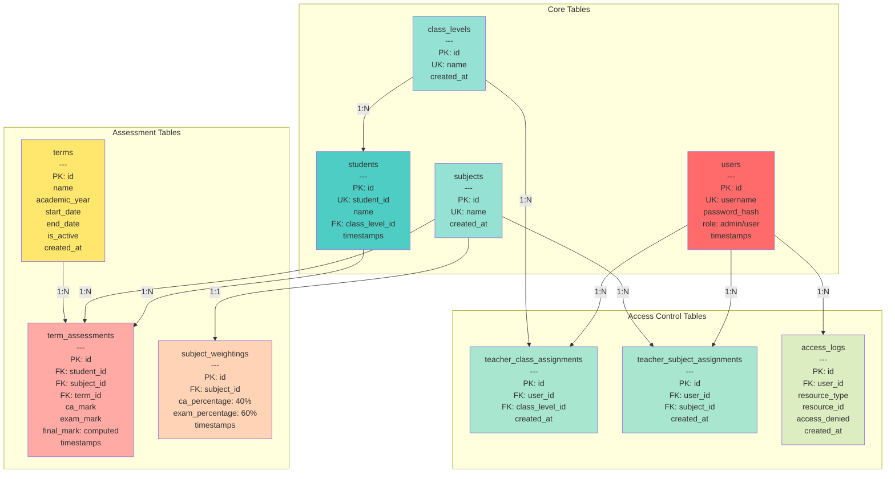
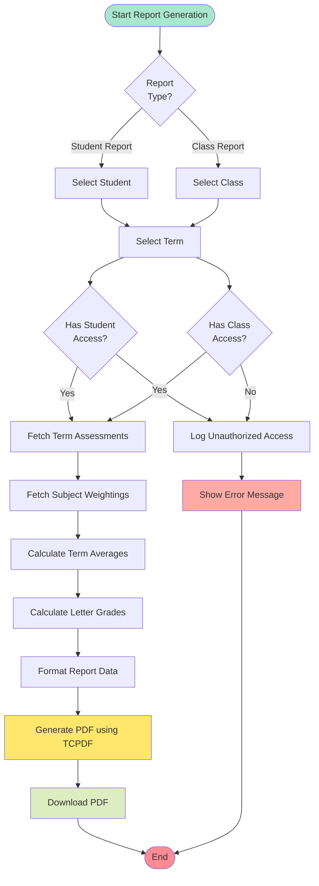
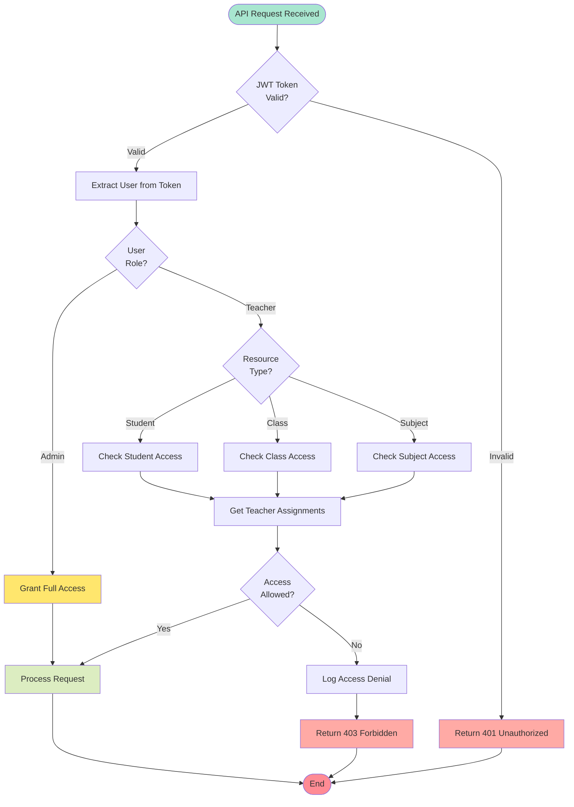

# Student Management System - Project Diagrams

## 1. System Architecture Diagram

## 2. Data Flow Diagram (Level 0 - Context Diagram)

## 3. Data Flow Diagram (Level 1 - Main Processes)

## 4. Entity Relationship Diagram (ERD)

## 5. Use Case Diagram

## 6. System Flow Chart (User Authentication Flow)

## 7. Assessment Recording Flow Chart

## 8. Database Schema Diagram (Detailed)

## 9. Report Generation Flow Chart

## 10. Access Control Flow Chart

---

## Diagram Descriptions

### 1. System Architecture Diagram
Shows the three-tier architecture: Client (Browser), Frontend (React), Backend (PHP), and Data (MySQL) layers with all major components and their relationships.

### 2. Data Flow Diagram (Level 0)
Context diagram showing external entities (Admin, Teacher) and their interactions with the system and database.

### 3. Data Flow Diagram (Level 1)
Detailed process breakdown showing six main processes: Authentication, Student Management, Assessment Management, Report Generation, User Management, and System Administration.

### 4. Entity Relationship Diagram
Complete database schema showing all tables, their attributes, primary keys (PK), foreign keys (FK), unique keys (UK), and relationships with cardinality.

### 5. Use Case Diagram
Shows all system use cases organized by user role (Admin vs Teacher) with include relationships between related use cases.

### 6. System Flow Chart (Authentication)
Detailed flow of user authentication process including token validation, credential verification, and role-based dashboard routing.

### 7. Assessment Recording Flow Chart
Step-by-step process for recording student assessments including access control checks, validation, and database operations.

### 8. Database Schema Diagram
Visual representation of database tables grouped by functionality (Core, Assessment, Access Control) with detailed field listings.

### 9. Report Generation Flow Chart
Process flow for generating PDF reports including data fetching, calculations, formatting, and PDF generation using TCPDF.

### 10. Access Control Flow Chart
Detailed flow of the role-based access control system showing how teacher permissions are validated for different resource types.

---

## Technology Stack Summary

**Frontend:**
- React 18.2
- React Router 6.20
- Axios for API calls
- Tailwind CSS 4.1 for styling
- Vite 5.0 as build tool

**Backend:**
- PHP 7.4+
- Custom MVC architecture
- JWT for authentication
- TCPDF for PDF generation
- PDO for database access

**Database:**
- MySQL 5.7+ / MariaDB
- InnoDB engine
- UTF-8 character set

**Security:**
- JWT token-based authentication
- Role-based access control (RBAC)
- Teacher-level resource permissions
- Password hashing with PHP password_hash()
- SQL injection prevention with prepared statements
- Access logging for audit trails
